# EDA Report: initial_eda

Rows: 96476
Columns: 21

## Dataset Overview

- Time column: `order_purchase_timestamp`
- Target column: `is_long_delivery`
- Numeric columns: 13
- Categorical columns: 7
- Duplicate ratio: 0.0000

## Missing Values

- `product_category_name_english`: 0.0436
- `payment_type_main`: 0.0300
- `freight_value_sum`: 0.0300
- `payments_count`: 0.0000
- `payment_installments_max`: 0.0000
- `payment_value_sum`: 0.0000

## Target Distribution

- `0`: 0.7500
- `1`: 0.2500

## Figures

- 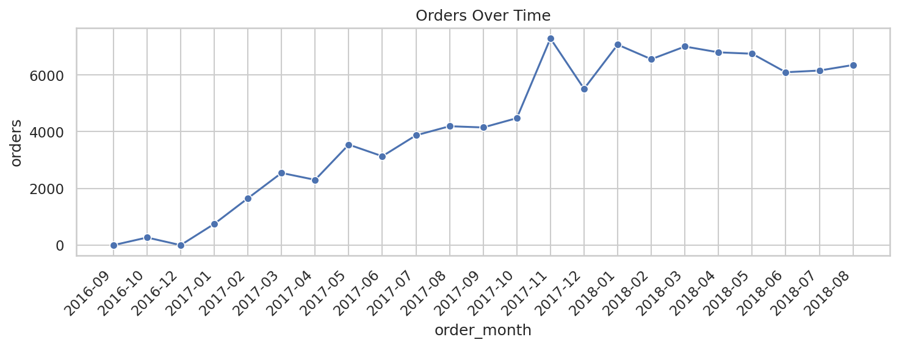
- 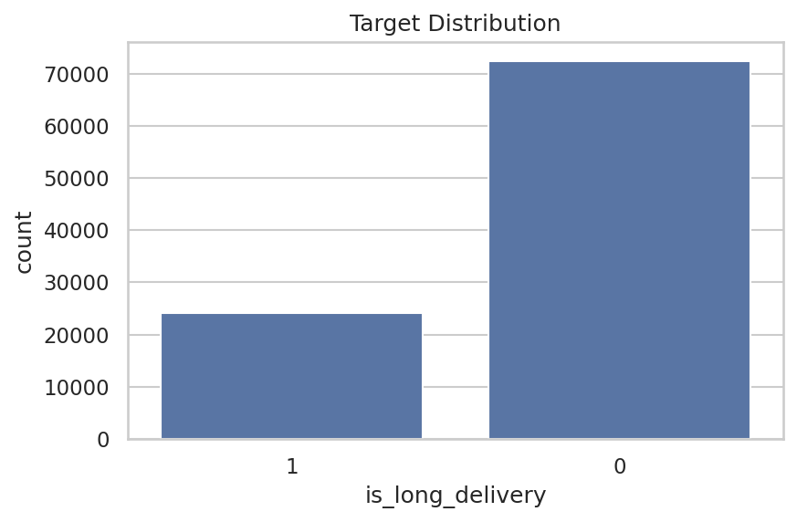
- 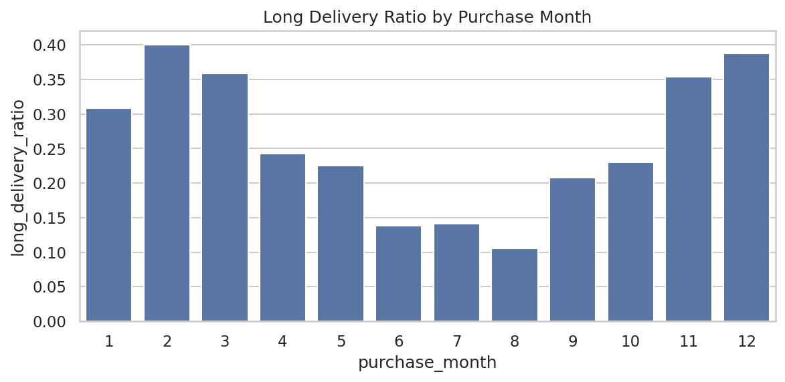
- 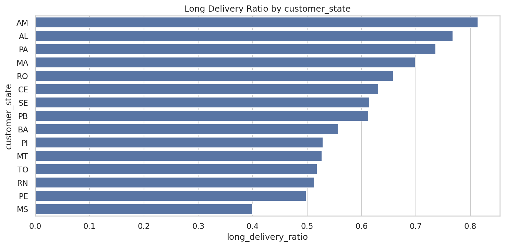
- 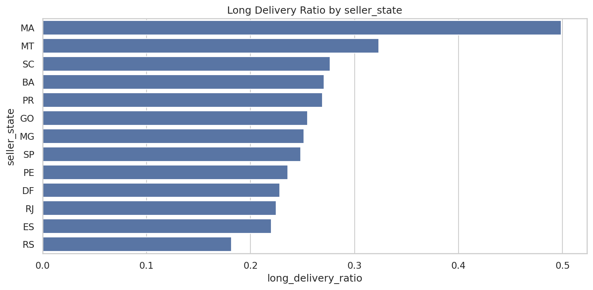
- 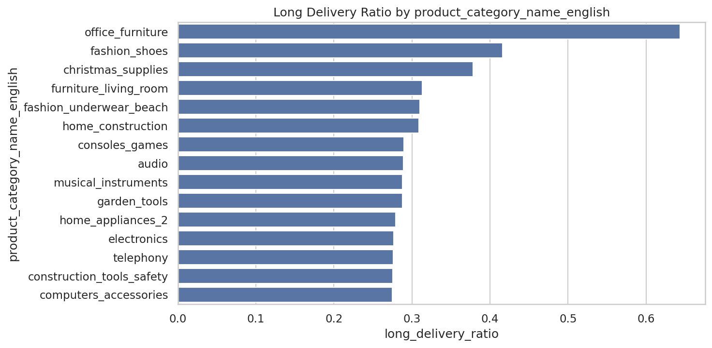
- 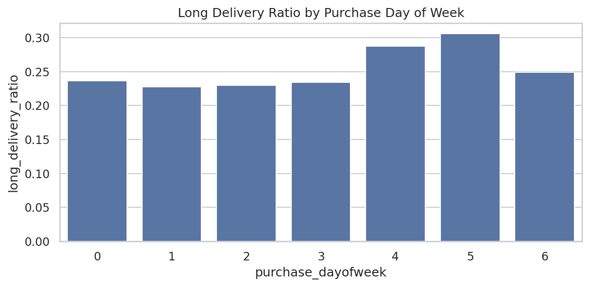
- 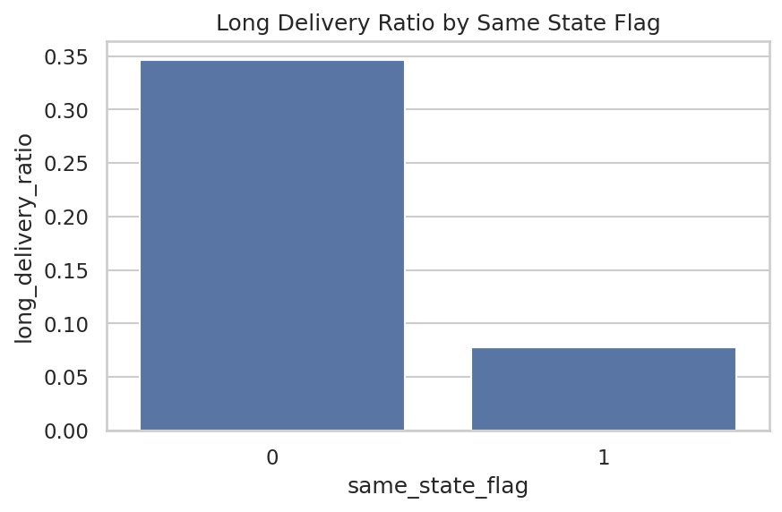
- 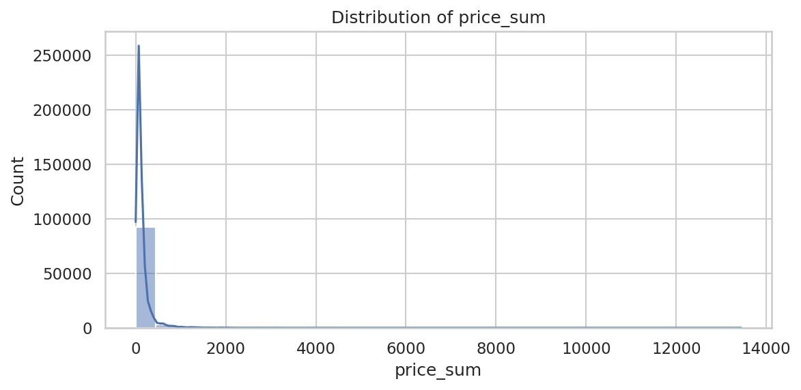
- 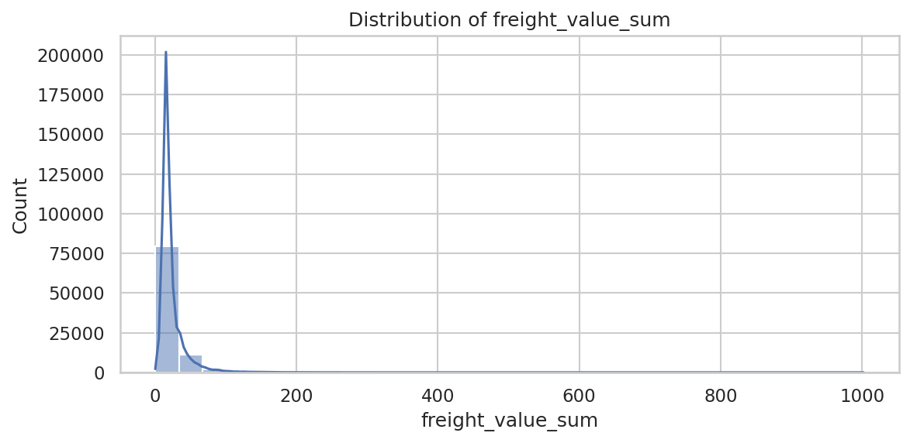
- 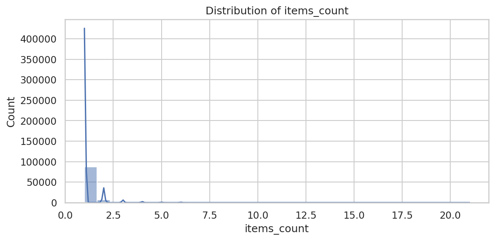
- 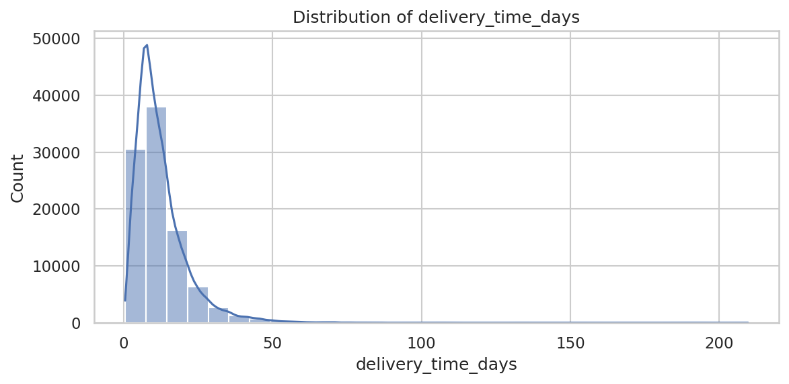
- 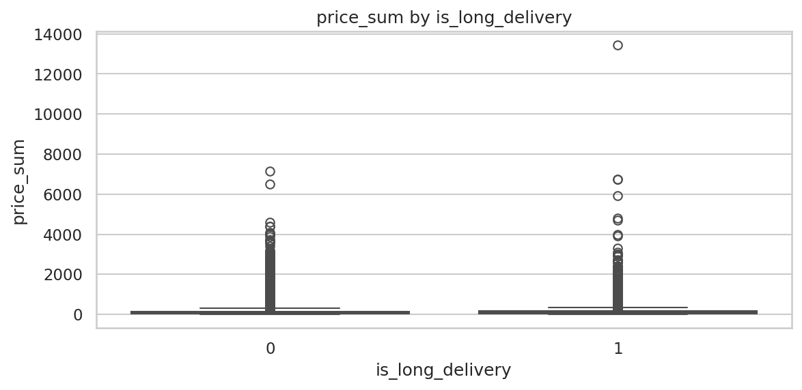
- 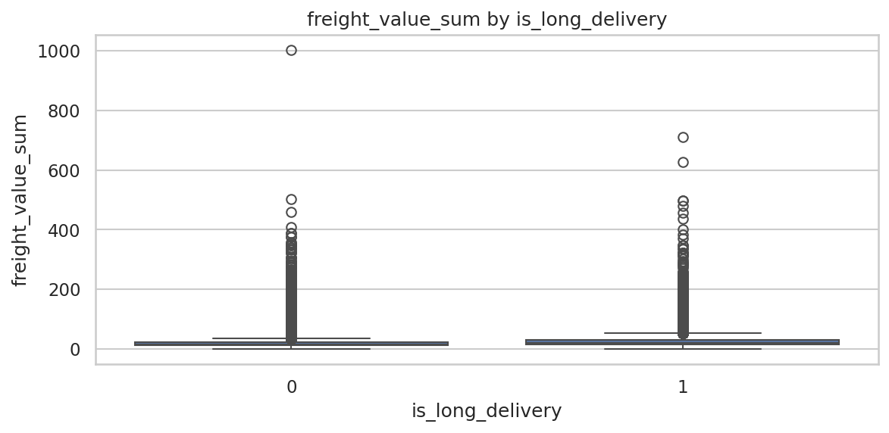
- 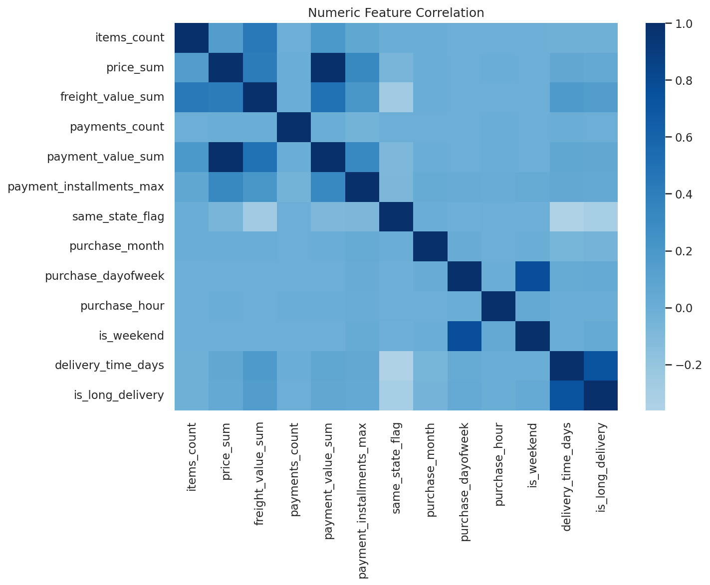
